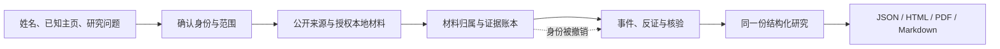

# StripSearch

**Research the person. Trace the evidence.**

从公开经历、作品与行动理解一个人，让每项判断都能回到证据。

StripSearch 是一个以身份核验和证据追溯为核心的人物研究 Web Agent。输入姓名或公开主页链接，系统核对身份、选择资料工具、整理带出处的 Person Object，并导出 JSON、HTML、PDF 或 Markdown。

> **当前阶段：人物研究 Web alpha，2026-10-02。新作业默认无固定累计上限，旧账本保留原限制。** DeepSeek / DSH 决策、Exa 网页检索、TikHub X 公开账号与帖子、按需 Firecrawl、持久化动作账本和证据撤回已实现。CLI、MCP、多平台覆盖与研究质量 benchmark 尚未交付。具体运行边界见[本轮实现说明](docs/person-research-release.md)。

**在线官网与工作台：** <https://stripsearch.103.195.188.236.sslip.io>（临时地址；注册默认开放，尚无邮件找回）。

**Web 入口：** [`apps/web`](apps/web/README.md) 提供同一份 canonical 报告上的真实认证、按账号隔离的 SQLite 研究作业、有预算的多步人物研究、公开资料读取与四种格式导出。运行方式、实际限制与未验证边界见该说明；这不代表 M1–M4 整体通过。

本轮入口：[初始化调研与实施方案](docs/initialization-research.md) · [验证记录](docs/initialization-validation.md)。探针验证程序约束与依赖兼容，不代表原 12 个研究案例或真实人物评测已通过。

## 一份好报告应该回答

1. **确定是这个人吗？** 候选、主页、材料归属与排除理由清楚；同名不合并。
2. **他实际做了什么？** 作品、贡献、选择、后续行动和结果有时间与证据。
3. **别人凭什么这样评价？** 保留原话上下文、观察关系、相反证据与未知。
4. **哪些结论还不能下？** 自述、已支持事实、冲突和分析假设分别呈现。

首个场景是公开创作者、研究者、技术作者的采访准备与作品研究。对普通个人，只处理明确授权的材料；资料稀疏时返回有限发现。项目不提供私人位置追踪、匿名身份揭露、泄露库查询或访问控制绕过。

## 设计导航

2026-10-02 GET-132：新增[连续研究体验设计](docs/research-experience.md)，以当前 Figma 阅读工作区为基线，衔接账号发现、一次范围确认、分批深读、证据核查与修订。对应[合成工作区演示](design/explorations/research-workspace-2026-10-02/index.html)是独立设计验证，不替换 Web alpha，不代表 Search / Fetch 已接线或研究质量已验收。

| 要了解什么 | 去哪里 |
|---|---|
| 为谁做、差异在哪里、什么值得验证 | [产品设计](docs/product.md) |
| 对外研究入口、Chat 与证据核查交互 | [Web 设计](docs/web-design.md) |
| 身份 → 行动 → 经历 → 第三方观察 → 可修订判断 | [研究方法](docs/research-method.md) |
| 范围冻结、完成判定与观测回执（地基） | [研究范围与完成契约](docs/research-completion-domain.md) |
| Search / Fetch 工具接口、角色权限与返回封套（地基） | [工具接口契约](docs/research-tool-contracts.md) |
| Fetch 处理覆盖回执与覆盖投影（GET-95 第一批；离线覆盖地基，无 live Fetch、无质量 benchmark） | [Fetch 处理覆盖契约](docs/fetch-coverage.md) |
| 版本化平台目录、逐能力状态与三个投影（地基） | [平台目录契约](docs/platform-catalog.md) |
| 公共账号规则导入、组合身份与独立受限执行器（地基） | [公共账号规则](docs/public-account-rules.md) |
| 发现路线规划、请求键与保守账号键（纯计划器，未接线） | [发现路线规划契约](docs/discovery-route-planning.md) |
| Agent、存档、证据依赖与失败恢复 | [系统架构](docs/architecture.md) |
| MCP、可配置首屏、人物索引与返回契约 | [接口设计](docs/interfaces.md) |
| 准确度、覆盖、数据集与对照实验 | [评估设计](docs/evaluation.md) |
| TikHub 与开源生态如何取舍 | [工具选型与调研](docs/providers.md) |
| 平台发现、身份校正与帖子追踪（holehe / maigret 接入） | [平台发现提案](docs/design/platform-discovery-2026-09-27/README.md) |
| 分阶段交付与验收 | [开发 brief / 路线](docs/roadmap.md) |

下一阶段（未实施提案）：[人物研究 Agent 设计稿](docs/superpowers/specs/2026-09-29-person-research-agent-design.md) · [交互与架构阅读页](design/explorations/agent-research-2026-09-29/README.md)。2026-09-30 已按用户批准的 Search / Fetch 长研究设计同步：Search / Fetch 两个 Agent 角色 + 持久程序控制器、首次发现冻结 PlatformRegistry 的目录级平台发现、分批深读与默认评论覆盖、总额 + 分批两级预算、范围撤回传播。X / Reddit / GitHub / 个人网站只是首批深读验证样本，不是发现上限。同日已落地[版本化平台目录](docs/platform-catalog.md)（GET-90，PR20 合并交付）与[公共账号规则](docs/public-account-rules.md)（GET-91，PR21 合并交付）：20 个 TikHub 平台、30 个替代平台与个人网站全部登记并带诚实缺口；Maigret / WhatsMyName 公共规则已按固定字节全量导入（逐行载入/排除回执、MIT / CC BY-SA 归属）并入目录，独立受限执行器离线可用但未接入运行时。同日新增[发现路线规划契约](docs/discovery-route-planning.md)（GET-92）：纯全目录路线规划、不透明请求键与保守账号键已实现（含独立审查后的 repair1 修复；待独立复审/CI/合并交付），不发请求、不接线、未 live 验证。以上能力均未上线、无任何 live 验证，当前代码仍是上文的预算受限 Web alpha。

先看一份[合成报告](examples/report.md)，再对照[同一份 JSON](examples/report.json)和[请求配置](examples/request.json)。样例域名 `example.org` 是占位标识，不应抓取。

2026-10-02 研究增量：[深度契约](docs/research-depth-contract.md)修复搜索摘要冒充原文、批次分支失败、资料截断后的自链发现和过早完成判断。五类研究问题分别显示已核验材料与缺口，四种导出共享同一状态；当前控制器回放采用版本化 [v2](evals/research-baseline-v2/README.md)。原始页面和正文不再固定裁剪，本地目录/正文窗口控制单次模型上下文；未验收新的长研究运行时、全平台完整历史或自主规划质量。

## 部署

官网与工作台共用 `apps/web`，采用 Nginx HTTPS + 单实例 Node / SQLite 部署。容器、持久化、注册控制、备份与回滚步骤见[部署说明](docs/deployment.md)。代码与容器检查不等于线上验收；实际发布版本通过 `/release.json` 核对。

## 核心设计

当前使用 **Exa + TikHub**，在普通网页正文读取缺失时按需使用 **Firecrawl**。采集器负责取得资料；StripSearch 负责把资料归给正确的人，并约束结论能说到哪一步。具体能力与未验证项见[选型](docs/providers.md)。

## 参与与复用

- 提交设计问题或失败案例：[Issue 模板](.github/ISSUE_TEMPLATE/)。请使用合成材料或有明确许可的公开职业资料。
- 建立研究、比较方案、改变设计：[三种工作模板](templates/README.md)。
- 校验当前设计材料：`python3 scripts/check_design.py`。它检查链接、样例与数据引用；不测试网络采集或模型效果。
- 测试 Web：`npm --prefix apps/web test`；运行冻结回放：`npm --prefix apps/web run eval`；运行控制器离线回放：`npm --prefix apps/web run eval:research`。数据与评分边界见 [Evaluation 数据集入口](evals/README.md)。
- 实现从[第一个里程碑](docs/roadmap.md#m1--最小可审计闭环)开始。

项目代码、文档和原创合成样例采用 [Apache-2.0](LICENSE)。链接到的服务、网页、第三方代码与用户档案不因此获得本仓库许可。当前没有收录第三方网页全文。

---

**English:** StripSearch is an authenticated, evidence-first person-research Web alpha. A bounded DeepSeek / DSH controller chooses public-source tools and produces a canonical Person Object with JSON, HTML, PDF and Markdown exports. Identity linkage, attributed statements, page statements and inferences remain separate. CLI, MCP, broad social-platform coverage and research-quality benchmarks are not released.
